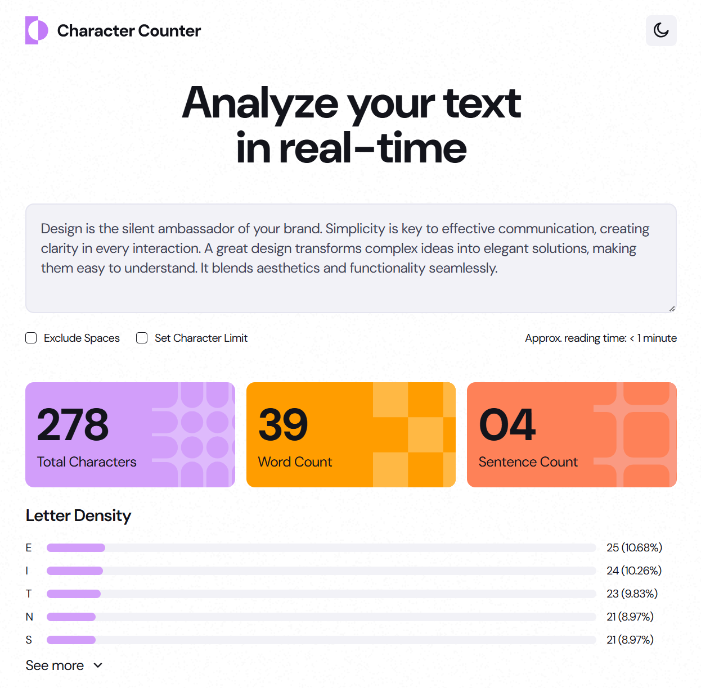
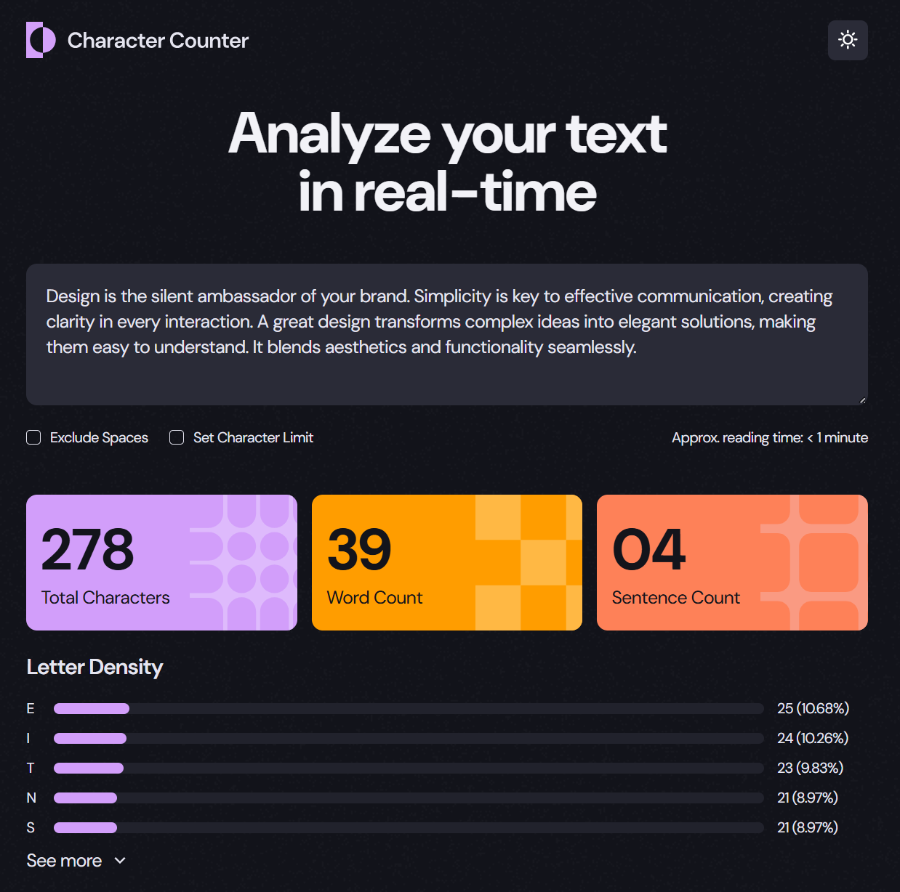
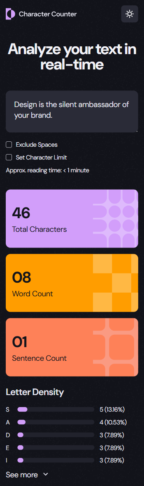

# Frontend Mentor - Character counter solution

This is a solution to the [Character Counter challenge on Frontend Mentor](https://www.frontendmentor.io/challenges/character-counter-znSgeWs_i6).

### Links

- Solution URL: https://github.com/aaronrubinstein/character-counter
- Live Site URL: https://aaronrubinstein.github.io/product-list-with-cart/

### Screenshots

**Light Mode**

**Dark Mode**

**Mobile**

